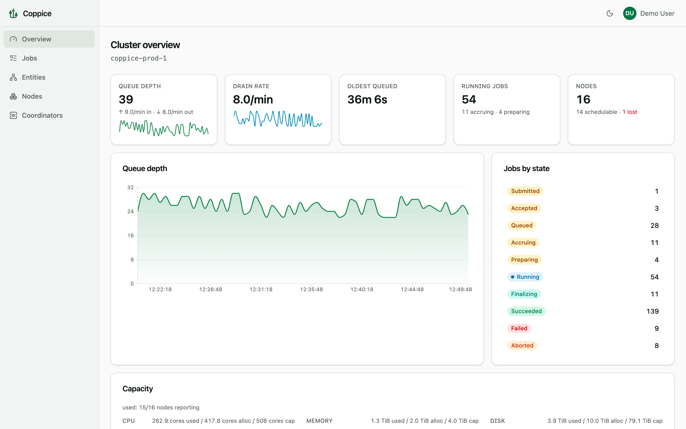
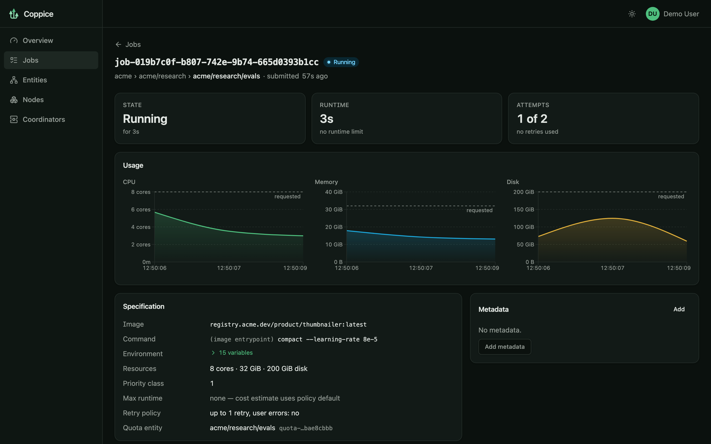
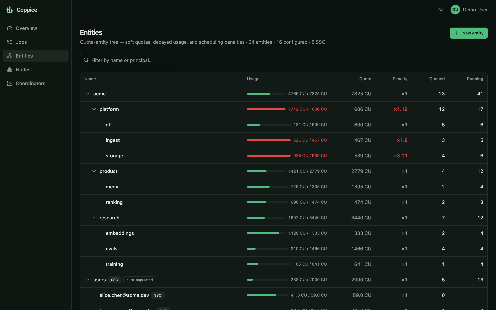
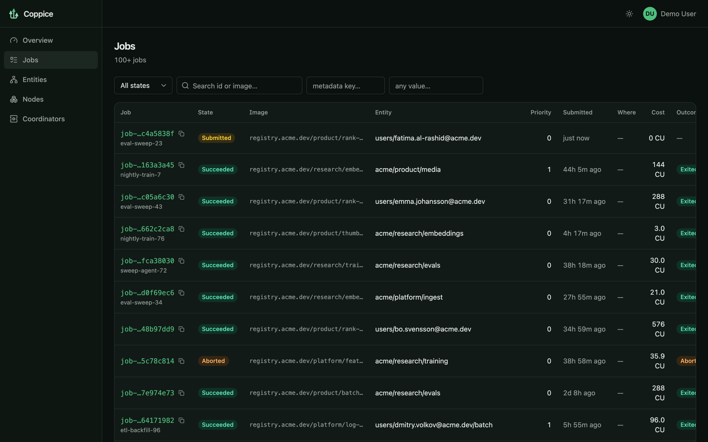
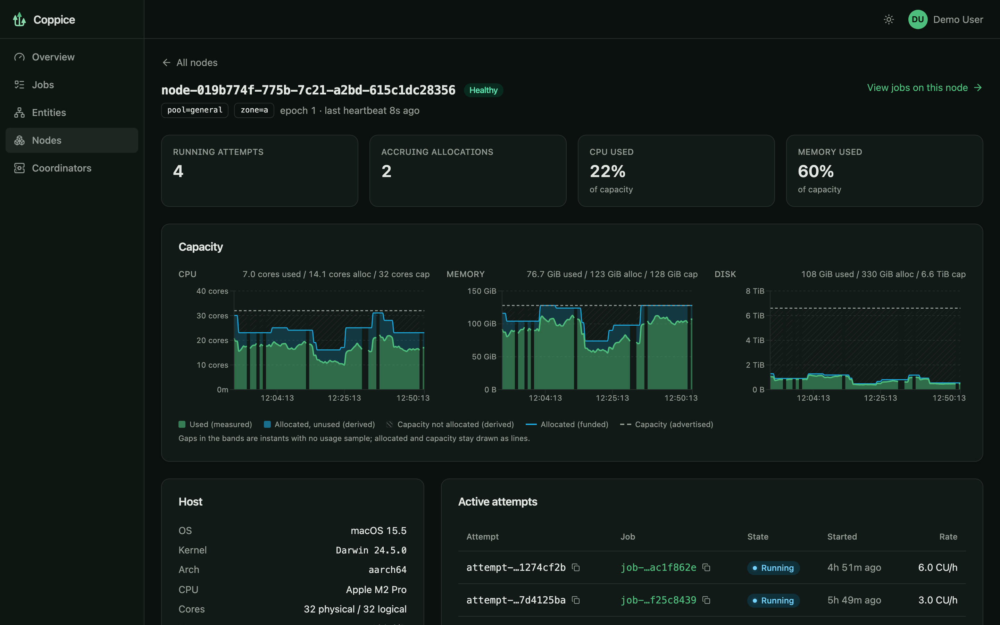

<p align="center">
  <picture>
    <source media="(prefers-color-scheme: dark)" srcset="docs/images/banner-dark.svg">
    
  </picture>
</p>

<p align="center">
  <a href="https://github.com/Joey9801/coppice-rs/actions/workflows/ci.yml"></a>
  
  
</p>

<p align="center">
  <a href="#quick-start">Quick start</a> ·
  <a href="#how-it-compares">Comparison</a> ·
  <a href="#aws-demo">AWS demo</a> ·
  <a href="docs/">Documentation</a> ·
  <a href="#development">Development</a>
</p>

Coppice is a distributed batch job scheduler, written in Rust. You submit jobs
as Docker images with resource requests; Coppice queues them, places them on a
fleet of nodes, supervises the containers through a per-node agent, and keeps
its own control plane available through Raft replication.

It is built for batch work: jobs lasting minutes to a day, deep queues, and
many teams sharing one cluster. Throughput, fairness, and being able to explain
why a job is where it is matter more here than millisecond placement latency.
It does not need Kubernetes. A cluster is one binary, run as a coordinator on
three machines and as an agent on the rest.

<p align="center">
  <picture>
    <source media="(prefers-color-scheme: dark)" srcset="docs/images/ui-overview.png">
    
  </picture>
</p>

<table>
  <tr>
    <td width="50%"></td>
    <td width="50%"></td>
  </tr>
  <tr>
    <td align="center"><sub>A running job: measured usage against what it requested</sub></td>
    <td align="center"><sub>The quota tree: decayed usage, soft quotas, and the resulting penalties</sub></td>
  </tr>
  <tr>
    <td width="50%"></td>
    <td width="50%"></td>
  </tr>
  <tr>
    <td align="center"><sub>Jobs, filterable by state, entity, node, and metadata</sub></td>
    <td align="center"><sub>A node: used, allocated, and advertised capacity over time</sub></td>
  </tr>
</table>

<sub>Screenshots show the UI's built-in demo mode, which runs on simulated data.</sub>

## Features

**Scheduling**

- **Soft quotas, no hard limits.** Teams and users form a quota tree of any
  shape. Each job has a cost; usage decays with a half-life. Going over quota
  never blocks a submission. It lowers your jobs' rank until your usage decays
  back, so an idle cluster is never left idle on a technicality
  ([quotas and priorities](docs/scheduling/quotas-and-priorities.md)).
- **One explainable ranking.** Priority class, quota penalty, and time spent
  waiting combine into a single effective score, and the UI shows a queued
  job's position and why ([ADR 0021](docs/decisions/0021-effective-score-ranking.md)).
- **Large jobs do not starve.** A job too big to fit anywhere claims capacity
  on a node as it frees up, until its request is fully funded. Smaller jobs
  backfill around it only when their enforced `max_runtime` proves they will
  be gone in time ([ADR 0014](docs/decisions/0014-accruing-allocations-replace-reservations.md)).
- Multi-resource placement over CPU, memory, and disk.

**Control plane**

- **Raft-replicated coordinators** with automatic leader failover. Replicated
  state uses integer arithmetic only, so every replica computes identical
  quota and scheduling results.
- **Cluster lifecycle from the CLI**: form a cluster, add and replace voters,
  drain and remove nodes, rotate the CA
  ([cluster lifecycle](docs/operations/cluster-lifecycle.md),
  [scale-in](docs/operations/scale-in.md)).
- **Built-in PKI.** The cluster owns its CA. Coordinators and agents enrol
  with a token and talk over mTLS from then on
  ([security](docs/operations/security.md)).

**Using it**

- **Web UI** compiled into the binary: queue health, jobs, the quota tree,
  nodes, and coordinator membership. Light and dark themes.
- **`coppice` CLI** for jobs (`submit`, `status`, `logs --follow`, `usage`,
  `abort`, `metadata`), nodes, quotas, and authorization policy.
- **HTTP API** with keyset-paginated listing, a JSON filter language, and a
  filtered, resumable server-sent event stream of job changes. A standalone
  Rust client lives in [`coppice-client`](crates/coppice-client).
- **OIDC sign-in** with offline JWT validation and no user database. Role
  bindings are scoped to subtrees of the quota tree, with an operator
  certificate as break-glass.
- **Job logs and measured usage** (CPU, memory, disk), plus Prometheus metrics
  from both coordinators and agents.

### Not there yet

Coppice is pre-1.0 and interfaces still change without compatibility shims.
Missing today: GPUs and other custom resource types, gang scheduling, array
jobs, preemption of running work, topology-aware placement, and a durable
history store for finished jobs. The design targets about 1,000 nodes and a
million queued jobs; that scale is not yet proven by a CI performance gate. See
[known open issues](docs/roadmap/known-open-issues.md) and
[future features](docs/roadmap/future-features.md).

## Quick start

You need a Rust toolchain and a running Docker daemon, plus Node if you want
the web UI (it is embedded from `web/dist` at compile time).

```sh
(cd web && npm ci && npm run build)     # optional: build the UI first
cargo run -p coppice-cli -- dev
```

`coppice dev` runs a complete single-node cluster in one process: coordinator,
scheduler, API, and an agent that launches real containers. It serves the API
and web UI on <http://127.0.0.1:7070> and seeds one quota entity. In a second
terminal, submit the example job:

```sh
cargo run -p coppice-cli -- job submit examples/jobs/stress-demo.toml
cargo run -p coppice-cli -- job logs <job-id> --follow
cargo run -p coppice-cli -- job usage <job-id>
```

The [example spec](examples/jobs/stress-demo.toml) is a five-minute synthetic
load designed to make the usage charts worth looking at. For real deployments,
see [deploy/](deploy/README.md) (install script and systemd units) and the
[configuration reference](docs/operations/configuration.md).

## How it compares

All of these are good at what they were built for. The table is about where
each one's centre of gravity is.

| | Coppice | HTCondor | Slurm | Nomad | Armada | Kueue |
| --- | --- | --- | --- | --- | --- | --- |
| Built for | Shared batch clusters running containers | High-throughput computing, cycle scavenging | HPC and tightly coupled parallel jobs | General orchestration: services and batch | Very high-volume batch across many Kubernetes clusters | Job queueing inside a Kubernetes cluster |
| Runs on | Its own agents, plus Docker | Its own daemons | Its own daemons | Its own agents | Kubernetes, plus Pulsar and Postgres | Kubernetes |
| Unit of work | Container | Process, container, or VM | Process or job step | Task (many drivers) | Pod | Any Kubernetes job type |
| Control-plane HA | Raft, built in | Standby central manager | Backup controller over shared storage | Raft, built in | Inherited from its dependencies | Inherited from Kubernetes |
| Sharing model | Decaying cost-based soft quotas, hierarchical | Decaying user priorities, hierarchical group quotas | Multifactor priority with fair-share | Hard quotas (Enterprise) | Fair share across queues | Hard quotas with borrowing between cohorts |
| Large-job starvation | Accruing allocations with strict backfill | Defragmentation and draining | Backfill scheduler | None built in | Preemption | Preemption |
| MPI and gang jobs | No | Parallel universe | Yes, its core strength | No | Yes | Yes |
| GPUs | Not yet | Yes | Yes | Yes | Yes | Yes |
| Web UI | Built in | No | No | Built in | Built in (Lookout) | Optional dashboard |

In practice:

- **Slurm** is the right tool for MPI, InfiniBand topology, and GPU
  partitions. Coppice does none of that. It is a better fit when the work is
  many independent containers and you want quotas that bend instead of
  partitions that sit empty.
- **HTCondor** is the closest in spirit, with decaying priorities and a focus
  on throughput. Coppice is container-only, replaces ClassAd matchmaking with
  a fixed resource model and one ranking, and replicates its control plane by
  consensus.
- **Nomad** is an orchestrator that also runs batch jobs. It schedules quickly
  but has no notion of fairness between tenants or of queue order under
  contention, which is most of what Coppice does.
- **Armada and Kueue** are the answer if your compute already lives in
  Kubernetes. Coppice is for fleets of plain machines where running
  Kubernetes, and for Armada a message bus and database as well, is more
  platform than the problem needs.

## AWS demo

The repository includes a Terraform stack that stands up a production-shaped
cluster on AWS and a smoke test that proves it works. It is the project's
end-to-end check that packaging, enrolment, TLS, sign-in, scheduling, and
telemetry all hold together on real hosts.

One `up.sh` provisions, in `eu-west-2` on arm64 Graviton instances:

- 3 coordinators forming a Raft cluster, and 3 Docker agents on spot
  instances in an autoscaling group;
- one network load balancer carrying the HTTPS API and web UI (ACM
  certificate, Route 53 name) and the mTLS agent plane as TCP passthrough;
- a Cognito user pool as the OIDC provider, so the API refuses requests
  without a token from the first minute;
- a small Prometheus instance that discovers and scrapes all six nodes;
- no SSH and no NAT gateway. Host access is through SSM only.

```sh
scripts/aws-demo/bootstrap.sh                # once per account: DNS zone and certificate
scripts/aws-demo/up.sh demo --tarball ./coppice-<version>-aarch64-unknown-linux-gnu.tar.gz
scripts/aws-demo/smoke.sh demo
scripts/aws-demo/down.sh demo --yes          # destroys everything and verifies nothing is left
```

The smoke test checks that unauthenticated requests get a 401, that there are
exactly three voters and three schedulable nodes, that Prometheus sees every
target, and that a real job runs to `succeeded` with its timeline, logs, and
usage intact. The cluster costs roughly $0.18 an hour while it is up.

The bootstrap stack's `domain` variable defaults to the maintainer's zone, so
set it to a domain you can delegate before running it in your own account.
Details are in
[deploy/aws/README.md](deploy/aws/README.md) and the
[demo plan](docs/roadmap/aws-demo-plan.md). Chaos scenarios (killing a
coordinator, replacing a worker) and a scheduled CI run of the demo are
planned and not yet built.

## Documentation

- [Overview](docs/overview.md) and [design principles](docs/design-principles.md)
- [Architecture](docs/architecture/): components, state model, storage engine, high availability
- [Scheduling](docs/scheduling/): the scheduling model, quotas and priorities
- [Operations](docs/operations/): configuration, cluster lifecycle, security, observability, failure handling
- [Decision records](docs/decisions/): why the design is the way it is

---

## Development

Everything below is for people working on Coppice itself.

### Workspace layout

| Crate | Responsibility |
| --- | --- |
| [`coppice-core`](crates/coppice-core) | Domain model: typed ids, resources, jobs, nodes, quota arithmetic. |
| [`coppice-proto`](crates/coppice-proto) | Wire protocol for the public API and agent–coordinator messages. |
| [`coppice-state`](crates/coppice-state) | The deterministic replicated state machine and its commands. |
| [`coppice-consensus`](crates/coppice-consensus) | Raft integration (openraft) and the segment storage engine. |
| [`coppice-scheduler`](crates/coppice-scheduler) | Asynchronous scheduler: ranking, placement, accrual planning. |
| [`coppice-api`](crates/coppice-api) | The `/api/v1` HTTP surface. Embeds the built web UI. |
| [`coppice-authn`](crates/coppice-authn) | OIDC discovery and offline JWT validation. |
| [`coppice-client`](crates/coppice-client) | Standalone, publishable Rust client for the HTTP API. |
| [`coppice-net`](crates/coppice-net) | gRPC services: Raft transport, membership admin, agent sessions. |
| [`coppice-tls`](crates/coppice-tls) | Cluster PKI and hot-reloadable mTLS material. |
| [`coppice-enroll`](crates/coppice-enroll) | Token-based enrolment of coordinators and agents. |
| [`coppice-discovery`](crates/coppice-discovery) | Seed discovery backends. |
| [`coppice-coordinator`](crates/coppice-coordinator) | Control-plane daemon tying consensus, scheduling, and the API together. |
| [`coppice-agent`](crates/coppice-agent) | Node agent: Docker executor, reconciliation, usage sampling. |
| [`coppice-cli`](crates/coppice-cli) | The `coppice` binary: coordinator, agent, `dev`, and client commands. |
| [`coppice-testkit`](crates/coppice-testkit) | Test-only: simulated filesystem with fault injection, crash harness. |

The web UI is a React and Vite app in [`web/`](web/README.md). Run it against
a local `coppice dev` with `npm run dev`, or with no backend at all using
`VITE_COPPICE_MOCK=1 npm run dev`.

### Building and testing

The toolchain is pinned by [`rust-toolchain.toml`](rust-toolchain.toml). The
proto schemas compile in-process, so no system `protoc` is needed. Tests run
under [nextest](https://nexte.st):

```sh
cargo fmt --all --check
cargo clippy --workspace --all-targets --all-features --locked -- -D warnings
cargo nextest run --workspace --all-features --locked --profile ci
scripts/sqlx-prepare.sh --check    # only if you touched a SQL query
```

The fleet suites start real multi-node Raft clusters and are slow. They run as
four shards (`--profile ci-fleet-1` to `ci-fleet-4`) and are worth running
locally only if you changed consensus, membership, or coordinator startup and
shutdown. Docker-gated tests skip silently when no daemon is reachable. CI
runs all of the above plus lint, format, test, and build for `web/`;
[`.github/workflows/ci.yml`](.github/workflows/ci.yml) is the authoritative
list.

### Conventions

- SQL goes through `sqlx` with compile-time checked queries. Regenerate the
  query cache with `scripts/sqlx-prepare.sh` when a query changes.
- No derived or memoized fields on the replicated `StateMachine`, and no
  floats in replicated state.
- No back-compat shims or migrations while the project is pre-1.0. Change the
  thing.
- Write a [decision record](docs/decisions/) for changes to architecture,
  contracts, or wire and storage formats. Localized changes do not need one.
- New metrics follow the per-module `describe_metrics()` /
  `gather_metrics()` pattern.
- Changes land by pull request with green CI and human review.

[AGENTS.md](AGENTS.md) has the longer version, including notes for coding
agents and the [known CI flakes](docs/agent-notes/ci-flakes.md).
[docs/testing/](docs/testing/end-to-end.md) covers the end-to-end strategy.

## License

Licensed under either of

- Apache License, Version 2.0 ([LICENSE-APACHE](LICENSE-APACHE))
- MIT license ([LICENSE-MIT](LICENSE-MIT))

at your option.

Unless you explicitly state otherwise, any contribution intentionally
submitted for inclusion in Coppice by you, as defined in the Apache-2.0
license, shall be dual licensed as above, without any additional terms or
conditions.
